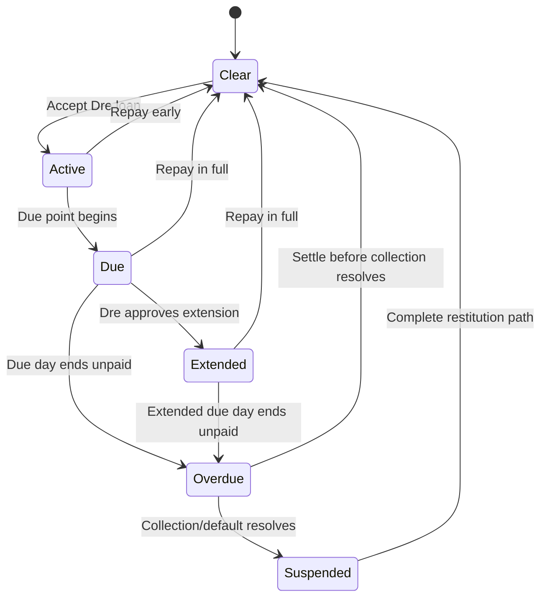

# Dre Lending and Loan-Shark Progression — System Design

**Status:** Approved with rulings; see DECISIONS.md (D-7, D-9, D-10)  
**Audience:** 907Hustle design, engineering, balance review, and ClickUp Brain  
**Scope:** The player's relationship with Dre, borrowing from Dre, Dre-led
contracts, and progression into the existing player-funded loan-shark hustle  
**Shared opportunity contract:**
`docs/STREET_OPPORTUNITY_AND_MISSION_SYSTEM_DESIGN.md`  
**Out of scope:** A fixed run length, a new combat system, MMO-style real-time
timers, or a general-purpose quest platform built before the first Dre chain is
proven

The shared opportunity document is authoritative for lifecycle, objectives,
deadlines, settlement, and cross-surface presentation. This document is
authoritative for Dre's lending economy, debt behavior, relationship milestones,
contract content, and Loan Book access. The existing lending and Shark domain
systems remain authoritative for their base transactions and consequences.

---

## 1. Executive summary

Dre should be both a lender and the gatekeeper to the loan-shark hustle.

The player first encounters Dre as somebody who can provide capital. The player
borrows, invests that capital elsewhere in the game, and establishes a repayment
history. Reliable repayment earns access to larger loans and better terms.
Further trust opens character-led contracts: checking on borrowers, delivering
money, handling late payments, and resolving collections. Completing those
contracts eventually earns access to Dre's borrower network, at which point the
player can put out their own money through the loan-shark system that already
exists.

The complete progression is:

```text
Meet Dre
→ borrow from Dre
→ use the capital in the wider game
→ repay, renegotiate, or default
→ build or damage trust
→ complete Dre's contracts
→ gain access to selected borrowers
→ fund and manage loans
→ collect, extend, or forgive defaults
→ expand the book through reputation, crew, and territory
```

This joins three design influences without copying any one of them literally:

- **Drug Lord 2:** capital allocation, debt pressure, risk, and repeated economic
  decisions.
- **Torn:** named mission givers, limited contracts, milestone missions, and
  difficulty progression.
- **907Hustle:** four-part days, personal relationships, Exposure, neighborhood
  memory, District Pressure, crew, territory, and persistent consequences.

The hard economic and consequence systems already exist. The missing work is a
progression and orchestration layer between "Dre lends to the player" and "the
player lends to Dre's borrowers."

---

## 2. Problem statement

The current build contains two disconnected halves of the intended fantasy.

### 2.1 Player debt is represented but dormant

`GameState.debt` and `debt_due_days` exist. The HUD can display debt, and the
Phone can show an obligation named **Debt to Dre**. A fresh run resets both
values to zero because no lender system currently creates, services, or collects
that debt.

The game therefore already anticipates the player owing Dre, but the player
cannot currently:

- request or accept a loan;
- compare terms;
- repay Dre;
- ask for an extension;
- default and face a Dre-specific collection;
- improve their borrowing access through a repayment history.

### 2.2 The existing Shark surface begins in the middle of the arc

`systems/shark.gd` and `ui/screens/shark.gd` currently make the player the
lender. The player selects an NPC borrower, amount, and term; advances cash;
waits for settlement; and responds to a default by enforcing, extending, or
forgiving. Dre takes 12% of returned interest.

That is an appropriate **later-stage hustle**, but the current unlock is an
elapsed Day-5 gate. Time passing does not explain:

- why Dre knows the player;
- why he trusts the player with his borrower network;
- why the player understands the business;
- why the player owes Dre a cut;
- what the player did to earn access to larger borrowers.

### 2.3 The current terminology obscures the two sides

The implementation uses "note" for loans in several places. That term is
financially valid but ambiguous in player-facing discussion because there are
two opposite positions:

- **Debt to Dre:** money the player owes Dre.
- **Loans Out / The Book:** money NPC borrowers owe the player.

This design uses those two names consistently. "Note" may remain in flavor
dialogue or internal compatibility code, but it should not be the primary UI
label.

### 2.4 Design opportunity

The missing bridge is a strong candidate for the game's first fully closed
progression loop because it can join existing systems instead of adding another
isolated hustle.

It touches:

- cash and clean/dirty wallet accounting;
- the four daily slots;
- Phone obligations and reminders;
- Exposure and Dre's personal lens;
- Word Around Town and introductions;
- the Requirements gate language;
- the existing Shark borrower and settlement system;
- the shared confrontation and consequence chassis;
- crew operations and territory in later tiers.

---

## 3. Design goals

### G1. Make Dre a relationship, not a menu

Access should come from meeting Dre, keeping or breaking agreements, and doing
work for him. A calendar threshold must not substitute for that relationship.

### G2. Turn borrowing into strategic pressure

Borrowing should create useful capital now and a meaningful obligation later.
It must change how the player evaluates jobs, trading, Scores, recovery, and
time—not merely add money and subtract a larger number later.

### G3. Earn the loan-shark hustle through play

The current player-funded borrower screen is the payoff to a progression arc.
It should not be automatically available because enough days passed.

### G4. Use contracts to point into existing mechanics

Dre contracts should ask the player to use real systems. A contract may require
a meeting, Wander discovery, a collection, or a resolved confrontation, but the
contract layer must not contain duplicate implementations of those mechanics.

### G5. Preserve 907Hustle's action economy

The system uses the existing four-part day. It does not add Energy, Nerve,
mission points, or real-time cooldown bars.

### G6. Let choices become reputation

On-time repayment, honest renegotiation, default, mercy, and violence should be
observations that Dre and the neighborhood interpret through the existing
Exposure system.

### G7. Remain open-ended

This system has no fixed seven-day arc and creates no run ending. Offers,
borrowing, and the loan book continue as long as the run supports them.

### G8. Prove one authored chain before procedural expansion

The first release should contain one Dre progression chain and the existing
borrower book. A universal mission generator is not a prerequisite.

---

## 4. Non-goals

The first version will not:

- introduce a separate Dre standing bar;
- introduce mission credits or job points;
- support multiple simultaneous player debts to Dre;
- support refinancing, collateral, guarantors, or amortization schedules;
- build a general banking simulation;
- generate dozens of procedural mission templates;
- create a new combat system for collections;
- automatically unlock the hustle on a particular day;
- require the Dre path for every viable run;
- turn all existing activities into mission checklist items;
- use activity-log copy as an objective-tracking API.

---

## 5. Design pillars

### 5.1 Capital has a source and a future cost

Money borrowed from Dre is liquidity, not earnings. It can enable an opportunity
the player otherwise could not afford, but the total repayment and due point
must be visible before acceptance.

### 5.2 Access and sentiment are different

The system needs two related but distinct concepts:

- **Dre access tier:** a persistent milestone recording what Dre has allowed the
  player to do. This is not a second opinion about whether Dre likes the player.
- **Dre Exposure disposition:** Dre's current interpretation of the player's
  behavior. This influences offers, terms, warnings, and dialogue.

Access tiers should not silently disappear because a disposition score decayed
or changed slightly. Serious debt failure can temporarily suspend access without
rewriting the player's completed milestones.

### 5.3 The Book is earned capability

Funding borrowers is not merely another button. It represents access to people,
knowledge of terms, and Dre's willingness to put his network behind the player.

### 5.4 A contract observes; a domain system settles

If a Dre contract asks for a collection, the collection/confrontation systems
decide what happened. If it asks the player to fund someone, the Shark system
moves the cash and owns the loan. The contract only determines whether its
objective was satisfied and applies its authored completion consequence once.

### 5.5 Failure creates play

Missing a deadline should not immediately terminate a run. It should produce a
decision, relationship damage, restricted access, and potentially a collection
encounter. Failure is a branch of the loop, not a dead end disguised as
punishment.

---

## 6. Terminology

| Term | Definition |
|---|---|
| **Dre account** | The player's borrowing relationship with Dre, including current debt and repayment history. |
| **Debt to Dre** | Principal, interest, and any approved fee the player currently owes Dre. |
| **Credit limit** | Maximum principal Dre will currently advance. Derived from access tier, account history, and current relationship conditions. |
| **Dre access tier** | Milestone permission: what kinds of borrowing, contracts, and borrower access the player has earned. |
| **Contract** | A limited offer from Dre that uses existing game mechanics and has acceptance, completion, failure, and relationship effects. |
| **Milestone contract** | An authored contract that promotes Dre access when completed. |
| **The Book / Loans Out** | The player's portfolio of NPC borrower loans, currently stored as `shark_loans`. |
| **Borrower** | An NPC who may receive money from the player after Book access is earned. |
| **Collection** | A decision or encounter caused by an unpaid loan. It may be negotiated, extended, forgiven, or enforced depending on context. |
| **Suspended** | Temporary loss of Dre services due to an unresolved player debt or serious contract failure. Completed access milestones remain recorded. |

---

## 7. Player progression

The exact labels are proposed. Their mechanical separation is the requirement.

| Tier | Player role | Access | Promotion proof |
|---:|---|---|---|
| 0 | **Unknown** | No Dre surface. Dre may be referenced through rumors or another NPC. | Receive an authored introduction. |
| 1 | **Borrower** | Meet Dre, view one basic offer, accept one active loan, repay. | Resolve the first Dre loan. An on-time repayment is the clean route; an authored recovery path may repair a late outcome. |
| 2 | **Trusted Customer** | Higher credit limit, additional term choice, extension request, first Dre favors. | Maintain a resolved account and complete an introductory favor. |
| 3 | **Collector** | Collection and borrower-vetting contracts. Confrontation or negotiation may be required. | Complete a milestone collection without leaving Dre's business unresolved. |
| 4 | **Junior Lender** | Unlock The Book, low-risk borrowers, limited concurrent loans, Dre's standard cut. | Successfully settle player-funded loans and maintain the relationship. |
| 5 | **Operator** | Higher-risk borrowers, larger book capacity, advanced contracts, and later crew/territory integration. | Future content; not required for the first vertical slice. |

### 7.1 Promotion rules

- Promotion is caused by an authored milestone, not a raw invisible score alone.
- Exposure disposition may be a requirement for receiving a milestone contract,
  but completion writes the access-tier latch.
- Access tier is monotonic in normal play.
- An unresolved default can set the Dre account to `suspended`, temporarily
  blocking borrowing, contracts, and new Book loans.
- Restitution clears suspension; it does not pretend the default never happened.

### 7.2 Optionality

The player may decline Dre's introduction or avoid borrowing. Jobs, Market,
907List, Scores, and other play remain available through their own discovery
paths. Dre is a powerful capital and progression route, not the only correct
opening.

---

## 8. Core loops

### 8.1 Borrowing loop

```text
Receive or request an offer
→ review principal, total due, due point, and consequences
→ accept funds
→ allocate capital elsewhere
→ repay, request an extension, or allow the debt to become overdue
→ update account history and Dre's Exposure ledger
→ change future credit access
```

The player-facing question is not "Do I want free money?" It is:

> Can I turn this capital into more value before Dre's obligation changes what I
> have to do with my remaining time?

### 8.2 Contract loop

```text
Dre offers limited work
→ player accepts, declines, or lets it expire
→ existing systems execute the requested activity
→ contract tracker observes the authoritative result
→ reward and Exposure consequences settle once
→ milestone or follow-up offer becomes eligible
```

### 8.3 Loan Book loop

```text
Review unlocked borrowers
→ choose borrower, amount, and term
→ advance player cash
→ wait through the ordinary game clock
→ receive repayment or default
→ extend, forgive, negotiate, or enforce
→ receive profit/loss and relationship consequences
→ expand or damage Book access
```

### 8.4 Long-term scale loop

Later content may allow:

- trusted crew to vet borrowers or make collections;
- territory to reveal or support borrower pools;
- district conditions to change repayment risk;
- Dre contracts to connect to Scores and local conflicts;
- Book capacity and terms to become an operational identity.

These are extension points, not MVP dependencies.

---

## 9. Player debt state machine

The player has at most one active Dre loan in the first version.



### 9.1 Required state meanings

- **Clear:** no money owed; borrowing availability is determined by access and
  current offers.
- **Active:** money is owed but not yet due.
- **Due:** the due point has arrived; the player still has the authored payment
  window.
- **Extended:** Dre granted one explicit new due point, normally with a cost or
  relationship consequence shown before confirmation.
- **Overdue:** the payment window closed. Repayment may still prevent the queued
  collection if it has not resolved.
- **Suspended:** Dre will not lend, issue new contracts, or open new Book loans
  until the authored restitution condition is satisfied.

### 9.2 Due-day rule

The player receives the entire due day. At the night settlement that ends the
due day, an unpaid account becomes overdue and schedules the next response.

Recommended lifecycle placement:

```text
crew → territory → shark receivables → Dre account → jobs → obligations
```

Settling player-funded receivables before the Dre account transition ensures
money genuinely due back that night is available before Dre declares the player
late. The exact ordering must be pinned in `DayLifecycle` tests before shipping.

### 9.3 Payment rules for the first version

- Viewing terms costs no slot.
- Repayment is a cash transfer and costs no slot.
- The first meeting with Dre costs one slot.
- Renegotiating or requesting an extension costs one slot unless an authored
  Phone offer explicitly says otherwise.
- Only full repayment is supported in the MVP; partial payments are deferred.
- One extension may be requested per loan.
- The total due never changes without the player being shown and confirming the
  change.

---

## 10. Proposed state model

Names are proposals; the behavioral ownership is more important than the exact
field spelling.

### 10.1 Dre progression

```gdscript
var dre_introduced: bool = false
var dre_access_tier: int = 0
var dre_account: Dictionary = {
    "status": "clear",
    "principal": 0,
    "interest": 0,
    "fee": 0,
    "opened_day": -1,
    "due_day": -1,
    "term_days": 0,
    "extension_used": false,
    "offer_id": "",
}
var dre_account_history: Dictionary = {
    "loans_taken": 0,
    "repaid_on_time": 0,
    "repaid_late": 0,
    "extensions": 0,
    "defaults": 0,
    "total_principal_borrowed": 0,
    "total_interest_paid": 0,
}
```

`credit_limit`, available terms, and current offer pricing should be derived
from access tier, account history, and Dre's live disposition. They should not
be stored copies that can disagree with their inputs.

### 10.2 Existing loan book

Keep `shark_loans` and `shark_next_loan_id` for compatibility in the first
implementation. Change their player-facing presentation to **The Book** or
**Loans Out** after access is earned.

Borrower catalogue rows should gain semantic access metadata, for example:

```gdscript
{
    "id": "nora",
    "access_tier_min": 4,
    "introduction_key": "dre_book_first",
    # existing risk, max, description, and settlement fields remain
}
```

### 10.3 Opportunity state

The opportunity substrate should be reusable, but the MVP authors only Dre
content.

```gdscript
var opportunity_offers: Array = []
var active_opportunities: Array = []
var opportunity_history: Dictionary = {}
```

One persisted opportunity instance needs:

```text
instance_id
definition_id
giver_id
state: offered | active | completed | failed | expired | declined
offered_day / offered_slot
accepted_day / accepted_slot
deadline_day / deadline_slot (optional)
objective progress
resolved outcome tier (optional)
claimed or settled receipt
```

The authored definition owns requirements, objective definitions, reward
instructions, failure policy, and follow-up IDs. Runtime instances contain only
what differs for this run.

### 10.4 Migration from dormant debt fields

Existing saves may contain `debt` and `debt_due_days`, even though normal fresh
runs currently set them to zero.

The next schema migration must:

1. Preserve a zero-debt save as a clear Dre account.
2. Convert positive legacy debt into a structured active or due Dre account
   using the best available due-day information.
3. Preserve the HUD and Phone read through a compatibility adapter until every
   caller reads `dre_account`.
4. Validate enum states, nonnegative amounts, due-day relationships, and one
   active account.
5. Never silently forgive or increase a legacy debt during repair.

---

## 11. System ownership and integration

### 11.1 Proposed owners

| Owner | Responsibility |
|---|---|
| `systems/dre_lender.gd` | Offers, borrowing, repayment, extension, overdue transition, suspension, and credit projections. |
| `systems/opportunities.gd` | Generic offer/accept/decline/objective/complete state; MVP contains only Dre definitions. |
| `data/dre_contracts.gd` | Authored Dre contract definitions and milestone order. |
| Existing `systems/shark.gd` | Player-funded borrowers, repayment/default settlement, and Book decisions. |
| Existing `Exposure` | What Dre and others think of observed behavior. |
| Existing `Requirements` | Eligibility for offers, actions, promotions, and surfaces. |
| Existing `OutcomeResolver` | Tiered resolution where an action is uncertain. |
| Existing `ConsequenceEngine` | Collection encounters and delayed fallout. |
| Existing `Wallet` | All cash movement and transaction provenance. |
| Existing `DayLifecycle` | Explicit order for due transitions, receivables, and offer refresh. |

### 11.2 Dispatch and objective observation

`GameManager.dispatch()` currently receives a detailed result dictionary from
the handling system but exposes only success/failure to callers. Opportunities
need an authoritative, non-UI way to observe outcomes.

Add an explicit post-action reconciliation point while the dispatch ownership
guard is still active and before persistent invariants, announcements,
autosave, and screen refresh.

The mechanism may be a declared observer registry or one named coordinator. It
must guarantee:

- exactly one observation per successful dispatch;
- access to `action`, input payload, and authoritative result;
- objective mutation before the single `notify_changed()`;
- no nested dispatch;
- deterministic observer ordering;
- failed dispatches do not advance objectives;
- an action that occurred but had an unfavorable outcome can still count when
  its result is `ok: true` with a failure tier.

State-based objectives must reconcile from authoritative GameState facts after
the action. Automatic day-settlement results require an explicit lifecycle
reconcile; they must not depend on a UI reopening or activity-log text.

### 11.3 Mutation rule

UI remains read-only. Screens dispatch actions and render projections. The Dre
lender, opportunity tracker, Shark system, Wallet, Exposure, and consequence
owners perform all persisted mutation under the existing dispatch/lifecycle
ownership rules.

---

## 12. Exposure and relationship rules

Dre already uses the STREET lens with strong weights for `financial` and
`honesty`. This is the correct substrate.

Recommended observations include:

| Player behavior | Observation | Audience/source | Design meaning |
|---|---|---|---|
| Accepts Dre's terms | `financial / accepted_terms` | Dre direct | Relationship begins; not inherently positive. |
| Repays on time | `financial / debt_repaid` | Dre direct | Strong positive evidence of follow-through. |
| Repays early | `financial / debt_repaid_early` | Dre direct | Positive, but should not be infinitely farmable. |
| Requests extension before due | `honesty / asked_before_due` | Dre direct | More honest than disappearing; pricing may still worsen. |
| Repays late | `financial / debt_repaid_late` | Dre direct | Resolves money but retains negative history. |
| Walks away from debt | existing `walked_a_debt` | Dre direct/network as authored | Serious negative evidence and suspension. |
| Completes Dre contract | `financial` or `loyalty` with contract-specific event | Dre direct | Advances eligibility for milestone work. |
| Refuses accepted work | existing `refused_work` | Dre direct | Different from declining an unaccepted offer. |
| Botches contract | existing `botched_mission` | Authored direct/network | Failure can travel beyond Dre when public. |
| Returns a borrower payment | existing `note_returned` behavior | Dre direct | Builds the lending relationship. |
| Forgives a borrower | existing `let_them_down` to Dre plus discretion to neighborhood | Existing behavior | Mercy has a business cost and social meaning. |
| Enforces violently | existing `collected_hard` | Dre/neighborhood | Recovers principal but creates Heat and reputation. |

Repeated identical repayment observations must respect Exposure's existing
effective-count ceiling so a player cannot farm infinite trust by cycling the
smallest loan.

Exposure affects offer quality and dialogue. Access promotion remains an
authored milestone latch.

---

## 13. Dre contracts

### 13.1 Contract categories

1. **Introduction contracts** — teach the relationship and establish Dre's
   expectations.
2. **Borrowing milestones** — resolve a player loan and prove repayment
   behavior.
3. **Vetting contracts** — use meetings, Wander, or known information to assess
   a borrower.
4. **Collection contracts** — negotiate or confront a late borrower using the
   shared consequence chassis.
5. **Book milestones** — successfully fund and settle selected borrower loans.
6. **Operator contracts** — later content involving crew, districts, and larger
   financial exposure.

### 13.2 First authored chain

Names are placeholders; the behavioral sequence is proposed.

#### DRE-ARC-01 — The Introduction

- Trigger: a real introduction fact, not elapsed time.
- Action: spend one slot meeting Dre.
- Result: set `dre_introduced`, promote access to Borrower, present one basic
  loan offer.
- No cash reward.

#### DRE-ARC-02 — First Money

- Trigger: Dre account clear and Borrower access.
- Choice: accept or decline a clearly priced loan.
- Objective: resolve the debt.
- Clean completion: repay within the authored window.
- Recovery completion: if late, complete the explicit restitution branch.
- Result: unlock Trusted Customer eligibility; record actual repayment behavior.

#### DRE-ARC-03 — A Reminder

- Trigger: Trusted Customer, account resolved, acceptable Dre disposition.
- Objective: handle a small collection or borrower check using existing
  meeting/Wander/consequence systems.
- Choices should permit at least negotiation and a harder approach where the
  authored scene supports them.
- Result: the authoritative outcome changes Dre and neighborhood Exposure.
- Milestone completion promotes the player to Collector.

#### DRE-ARC-04 — Your First Name in the Book

- Trigger: Collector milestone complete and account not suspended.
- Dre sponsors one named low-risk borrower as a mission-only introduction. The
  active milestone is the borrower's temporary eligibility; ordinary Book access
  is not required, so the gate is not circular.
- Objective: fund that borrower through the real Shark system and resolve the
  loan.
- Result: promote to Junior Lender and expose the existing Book surface as a
  standing hustle.

### 13.3 Repeatable contracts after the chain

After Junior Lender access, Dre may maintain a limited pool of offers. The
recommended first rule is:

- maximum three offered or active Dre contracts;
- at most one new offer generated at an in-game day start;
- no real-time waiting;
- offer generation occurs after the latest repayment, Exposure, and consequence
  state has settled;
- declining an unaccepted offer has a smaller or zero consequence depending on
  wording;
- accepting and abandoning work has a clear relationship consequence;
- milestone contracts are authored and cannot be replaced by random offers.

### 13.4 Objective authoring rule

Prefer situational goals over grind counts.

Good examples:

- resolve a named borrower's problem before Night;
- bring back at least the principal without creating a neighborhood scene;
- learn whether a borrower is reliable;
- complete one specific loan without asking Dre to intervene;
- collect while keeping Heat below an authored band.

Avoid:

- "perform three Lifts";
- "click the Shark screen";
- "wait seven real-time days";
- objectives detected by matching activity-log strings;
- missions whose bonus dominates the real economic outcome.

---

## 14. Borrowing economics

Exact numbers require the economy instrument. This design specifies the rules
that the numbers must satisfy.

### 14.1 Offer projection

Before accepting, show:

- cash received now;
- interest and fees;
- total due;
- exact in-game due day/part;
- extension availability;
- account consequence of nonpayment;
- whether the meeting or acceptance consumes a slot.

### 14.2 Wallet classification

- Dre principal is **not earnings** and must never call `record_earning`.
- Principal enters through Wallet with a distinct `source_id` such as
  `dre_borrow`.
- Unless design rules otherwise, the cash is street/dirty liquidity for wallet
  classification, because its origin is Dre—not wages or legal trade.
- Repayment uses the ordinary wallet owner and records principal, interest, and
  fee separately for auditability.
- No code path directly edits total cash.

### 14.3 Credit projection

Recommended shape:

```text
base credit limit by Dre access tier
adjusted by repayment-history band
adjusted by current Dre disposition band
blocked by active debt or suspension
```

Do not expose raw Exposure scores. Present a relationship-readable offer:

- "Dre will put up $X";
- "Only the short money is open right now";
- "Clear what you owe before asking again."

### 14.4 Borrow-to-lend invariant

The game may allow the player to borrow from Dre and put that cash into The
Book. It should not need an artificial prohibition if the economics are sound.

However, no accessible combination may create a risk-free positive carry where:

```text
guaranteed Book return after Dre's cut
> guaranteed repayment cost to Dre
```

Any profitable leverage must include meaningful default risk, time pressure,
opportunity cost, or relationship exposure. The economy instrument needs a
specific leveraged-lender profile before release.

### 14.5 Balance comparisons

Measure at least:

- player who never meets Dre;
- player who borrows for legal work/trading capital;
- player who borrows for Scores;
- player who repays every Dre loan on time;
- player who repeatedly extends;
- player who defaults;
- player who reaches The Book without borrowing again;
- leveraged lender who borrows from Dre and funds NPCs;
- player who uses enforcement on every default;
- player who extends or forgives every default.

Report results relative to the existing legal-worker baseline. Do not tune in
the same change that first measures the system.

---

## 15. UI and information architecture

### 15.1 Phone — Dre contact

Once introduced, Dre receives a Phone/contact surface showing:

- current relationship-facing copy;
- available loan offer or reason none is available;
- Debt to Dre: principal, total due, and due point;
- repay and request-extension actions;
- available and active Dre contracts;
- the latest meaningful message from Dre.

### 15.2 Finances — separate positions

The financial view must show two separate sections:

1. **DEBT TO DRE — YOU OWE**
2. **THE BOOK — THEY OWE YOU**

Never merge both into one "notes" total.

### 15.3 Hustle hub

- Before introduction: no Shark/Book row merely because a day threshold passed.
- Borrower/Trusted tiers: Dre may appear through Phone/People/Finances, but The
  Book remains hidden.
- Junior Lender: announce and reveal **THE BOOK** as an earned hustle.
- Suspended: show the known surface as temporarily blocked with the real reason;
  do not pretend the player forgot it exists.

### 15.4 Home

Home should surface only actionable Dre information:

- loan due soon or overdue;
- one active contract and its deadline;
- a newly available milestone;
- a returned/defaulted Book loan requiring a decision.

It should not become a permanent mission checklist.

### 15.5 Consequence presentation

Collections use the shared consequence screen. Results must communicate:

- cash recovered or still outstanding;
- Heat/Health changes where player-facing;
- what Dre now permits or blocks;
- whether the contract or account is resolved;
- the next actionable decision.

---

## 16. Gating changes

Replace the current `HUSTLE_SHARK` requirement of `day_min: 5`.

Proposed semantic gates:

| Surface/action | Requirement |
|---|---|
| Dre contact visible | `dre_introduced == true` |
| Request first loan | Dre access at least Borrower; account clear; not suspended |
| Request higher offer | required access tier; resolved account; authored relationship/history conditions |
| Receive collection contract | access at least Trusted Customer; no unresolved player debt unless the contract explicitly addresses it |
| The Book visible | access at least Junior Lender |
| Fund new borrower | Book visible; borrower tier unlocked; capacity available; account not suspended; sufficient cash |
| Fund milestone borrower | active authored Book-introduction opportunity; account not suspended; sufficient cash |
| Advanced borrower | Operator or authored milestone requirement |

Add semantic Requirement types only for facts that already have a canonical
owner. Recommended types include:

- `dre_access_tier_min`;
- `dre_account_status_is` or a narrow `dre_account_clear`;
- `opportunity_completed` for named milestones;
- `book_capacity_available` if capacity cannot be expressed by existing facts.

Unknown requirement types continue to fail closed.

---

## 17. Failure, collections, and recovery

### 17.1 Player default

An unpaid Dre debt should progress through warning, overdue, and collection. It
must not be a silent cash subtraction.

The response may include:

- Dre services suspended;
- direct and network Exposure observations;
- an authored collection encounter;
- loss of favorable terms;
- a restitution contract;
- money, inventory, Health, or relationship consequences settled through the
  appropriate existing owners.

The first version should choose one collection path and prove it through the
shared consequence chassis rather than authoring several incomplete variants.

### 17.2 Honest extension

Asking before the deadline should be meaningfully different from disappearing.
An approved extension may cost:

- an explicit fee;
- a higher total due;
- one slot for the meeting;
- a less favorable future offer;
- a small relationship consequence.

It should still be a legitimate strategic choice.

### 17.3 Restitution

Suspension needs a visible recovery condition. Examples include paying the
remaining amount, completing a specific restitution contract, or both. The
condition must be authored and inspectable; it must not depend on waiting for a
hidden disposition score to drift.

### 17.4 NPC borrower default

Keep the existing choices:

- **Extend:** preserves the possibility of full repayment but leaves capital
  unavailable longer.
- **Forgive:** writes off the debt, affects Dre, and may create neighborhood
  discretion.
- **Enforce:** attempts recovery and creates Heat/violence consequences.

Future negotiation may be added through the shared confrontation chassis, but
the existing three-way decision should remain valid.

---

## 18. Save, determinism, and lifecycle requirements

- Every loan offer, contract, default roll, and generated target uses existing
  seeded deterministic rules.
- Save/load must preserve exact Dre account state, offer instances, objective
  progress, Book loans, and queued collection consequences.
- Reopening a screen must never generate a different offer or advance an
  objective.
- Each payment, promotion, contract settlement, and consequence must claim an
  idempotent receipt before mutation.
- Day settlement ordering is declared and tested; no signal connection order
  defines financial behavior.
- Offer refresh happens after the prior day has fully settled.
- A due-day transition or collection queued during a slot advance is persisted
  before the resulting screen refresh.

---

## 19. Acceptance criteria

### 19.1 Introduction and access

- A fresh run does not expose The Book because a day number was reached.
- A real introduction unlocks Dre's contact and first meeting.
- Declining the introduction does not break other progression paths.
- The Book remains unavailable until its milestone contract is complete.

### 19.2 Borrowing

- The player can inspect an offer without mutation.
- Accepting credits the exact principal once and records no earnings.
- The UI displays total due and the exact due point before confirmation.
- The player can repay in full through Wallet exactly once.
- The player receives the full due day.
- One approved extension updates the due point and displayed total exactly once.
- An unpaid debt becomes overdue and schedules one collection response.
- Save/load at every account state preserves the same result.

### 19.3 Relationship and progression

- On-time repayment writes the authored Dre observation.
- Late payment, extension, and default remain distinct historical outcomes.
- Repeating the smallest loan cannot farm unlimited trust.
- Milestone completion promotes access once.
- Suspension blocks services without erasing completed milestones.
- Restitution visibly clears suspension.

### 19.4 Contracts

- An objective advances only from an authoritative action result, state fact,
  or consequence receipt.
- UI navigation and activity-log text cannot complete objectives.
- Declined, expired, failed, and completed are distinct states.
- Completion and rewards settle once across save/load.
- A contract that uses Lift, Stickup, Wander, or confrontation does not contain
  duplicate payout/Heat logic.

### 19.5 The Book

- Junior Lender access reveals the existing borrower-funding surface.
- Locked borrowers are absent or correctly explained according to the access
  presentation rule.
- Funding, repayment, default, extension, forgiveness, and enforcement retain
  their existing economic ownership.
- Dre's cut remains visible in the return projection.
- No measured starter combination creates risk-free borrow-to-lend profit.

### 19.6 Regression gates

- Save validation passes with legacy debt, structured Dre debt, and existing
  `shark_loans` fixtures.
- Screen smoke instantiates Phone, Home, Finances, Dre, Book, and consequence
  states.
- Confrontation tests cover the first Dre collection path.
- Existing territory, job, wallet, Exposure, and Shark settlement tests remain
  green.
- Economy instrumentation adds and reports the Dre profiles without changing
  their numbers in the measurement-only change.

---

## 20. Recommended implementation slices

### Slice 0 — Design rulings

Resolve the open questions in Section 22 and record approved decisions in
`docs/DECISIONS.md`. No production behavior.

### Slice 1 — Structured Debt to Dre

- Add `dre_lender` owner and structured account state.
- Add borrow, repay, due, overdue, and one extension.
- Migrate dormant legacy debt fields.
- Wire Phone/HUD/Finances.
- No mission engine and no Book unlock changes yet.

**Exit:** one complete borrow → use time elsewhere → repay/default loop survives
save/load.

### Slice 2 — Introduction and access

- Add `dre_introduced` and access tier.
- Replace Day-5 Shark gate.
- Add first meeting and first-loan authored offer.
- Wire Exposure observations and suspension/restitution.

**Exit:** a fresh player can earn Borrower access and cannot reach The Book
through a back door.

### Slice 3 — Minimal opportunity substrate

- Add offered/active/resolved opportunity state.
- Add post-action and lifecycle reconciliation.
- Author First Money as the first milestone.
- Add Phone/Home presentation.

**Exit:** one authored objective tracks authoritative state and settles once.

### Slice 4 — Collector milestone

- Author A Reminder.
- Drive its risky branch through the shared consequence chassis.
- Add failure, decline, and restitution outcomes.

**Exit:** Dre's contract has at least two meaningful resolution approaches and
changes later access.

### Slice 5 — Earn The Book

- Author the first low-risk borrower milestone.
- Promote to Junior Lender.
- Reveal and rename the existing Shark surface.
- Gate borrower rows and concurrent book capacity by earned access.

**Exit:** the complete borrower → trusted → collector → lender progression is
playable without debug state.

### Slice 6 — Measurement and expansion

- Add economy profiles and tune only in a later, explicitly authorized pass.
- Add repeatable Dre contracts after the authored chain proves the substrate.
- Evaluate crew and territory integrations separately.

---

## 21. Suggested ClickUp structure

### Epic

**Close the Dre Credit → Contract → Loan Book Loop**

### Proposed tasks

1. **DRE-001 — Approve Dre system rulings and terminology**
2. **DRE-002 — Structured player debt and legacy save migration**
3. **DRE-003 — Borrow, repay, extend, overdue, and suspension lifecycle**
4. **DRE-004 — Dre Exposure observations and restitution**
5. **DRE-005 — Replace Day-5 Shark gate with earned Dre access**
6. **DRE-006 — Dre Phone/Finances/Home presentation**
7. **DRE-007 — Minimal opportunity state and authoritative objective tracking**
8. **DRE-008 — First Money milestone contract**
9. **DRE-009 — A Reminder collection contract and confrontation integration**
10. **DRE-010 — Junior Lender milestone and Book reveal**
11. **DRE-011 — Save, smoke, behavioral, and idempotency coverage**
12. **DRE-012 — Economy profiles and balance report**

Tasks should carry the relevant acceptance criteria from Section 19 rather than
restating the whole design in separate, potentially divergent prose.

---

## 22. Open design decisions

The following require explicit evaluation before implementation.

| ID | Decision | Recommended default |
|---|---|---|
| DRE-D1 | How is Dre first introduced? | Authored NPC/Word Around Town introduction; never elapsed day alone. |
| DRE-D2 | Does accepting the first loan cost a slot? | First meeting costs one slot; later draw/repay cash transfers do not. |
| DRE-D3 | Are partial repayments supported? | No for MVP. Full repayment keeps state and presentation legible. |
| DRE-D4 | Can access tiers fall? | Milestones remain; serious default suspends services until restitution. |
| DRE-D5 | Can the player borrow from Dre to fund The Book? | Yes, if measurement proves there is no risk-free arbitrage. |
| DRE-D6 | What happens immediately after default? | Overdue schedules one authored collection response; no instant run ending. |
| DRE-D7 | What unlocks Junior Lender? | Complete one borrowing milestone and one collection milestone, then resolve the first authored Book loan. |
| DRE-D8 | Does Dre have a visible numeric rank? | No. Show access through role labels, available terms, and dialogue. |
| DRE-D9 | Is a separate mission currency needed? | No. Rewards are cash, access, relationship, information, or opportunity. |
| DRE-D10 | What is the surface called? | "Dre" for the relationship/account; "The Book" for player-funded loans. |
| DRE-D11 | Where does Dre account settlement sit? | After Shark receivables and before jobs/obligations; pin with lifecycle tests. |
| DRE-D12 | How many active Dre contracts? | Maximum three offered/active; at most one new offer per in-game day after MVP. |

Exact principal limits, rates, fees, and deadlines remain balance parameters and
must be selected through measurement after the behavioral loop is approved.

---

## 23. Risks and mitigations

### Risk: A mission engine becomes a second game

**Mitigation:** Author one Dre chain. Contracts observe existing systems and do
not own payout, Heat, travel, confrontation, or borrower settlement.

### Risk: Duplicate relationship state

**Mitigation:** Exposure remains sentiment. `dre_access_tier` records milestone
permission only. No separate numeric Dre standing currency.

### Risk: Debt becomes either free capital or unavoidable punishment

**Mitigation:** Show total cost, preserve optionality, allow honest extension,
and measure multiple capital-use profiles before tuning.

### Risk: Borrow-to-lend arbitrage trivializes the economy

**Mitigation:** Add an explicit leveraged-lender profile and assert that no
accessible combination is risk-free positive carry.

### Risk: Existing Shark behavior regresses during reframing

**Mitigation:** Keep `systems/shark.gd` as the loan-book owner, preserve its save
shape initially, and gate/relabel it rather than rewriting settlement.

### Risk: Automatic settlement order creates unfair late states

**Mitigation:** Declare Dre's lifecycle position and verify that receivables due
that night settle before the player's debt becomes overdue.

### Risk: The player cannot tell which side of the debt they are on

**Mitigation:** Use **Debt to Dre — You Owe** and **The Book — They Owe You** as
separate sections everywhere.

### Risk: A failed Dre path permanently bricks content

**Mitigation:** Suspension always has an authored, visible restitution route.

---

## 24. Questions for ClickUp Brain evaluation

ClickUp Brain should evaluate this proposal against the current backlog and
answer:

1. Does the proposed progression reconcile the dormant player-debt UI with the
   existing player-funded Shark system without duplicating either?
2. Are any existing ClickUp tasks already intended to implement Dre's lender or
   mission arc, and should they be merged into the proposed epic?
3. Does any proposed state duplicate an existing authoritative GameState,
   Exposure, Requirements, consequence, or save field?
4. Is the Borrower → Trusted Customer → Collector → Junior Lender progression
   understandable and free of circular gates?
5. Is the first vertical slice small enough to validate before a generalized
   mission framework is built?
6. Which balance exploits arise from borrowing from Dre, trading/doing Scores,
   and funding NPC borrowers with the same capital?
7. Which failure states or save migrations are missing from the acceptance
   criteria?
8. Which current tasks should be superseded, narrowed, or reordered if this
   system becomes the approved progression spine for Dre?
9. Does the proposed lifecycle ordering conflict with any already-approved
   settlement contract?
10. What is the smallest task sequence that produces a player-visible closed
    loop without landing unused substrate?

---

## 25. Final design test

The system succeeds when a player can tell this story without reading a help
page:

> Dre fronted me money when I needed it. I made something happen with it and
> paid him when I said I would. After that he trusted me with work, then with
> names. Now people owe me, Dre gets his cut, and every late payment is my
> decision to handle.

If the player instead experiences "Shark unlocked because Day 5 arrived," the
system has not achieved its purpose.
